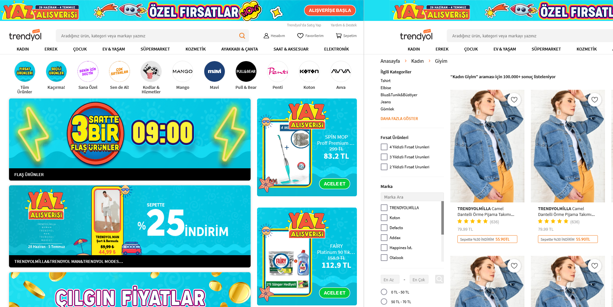
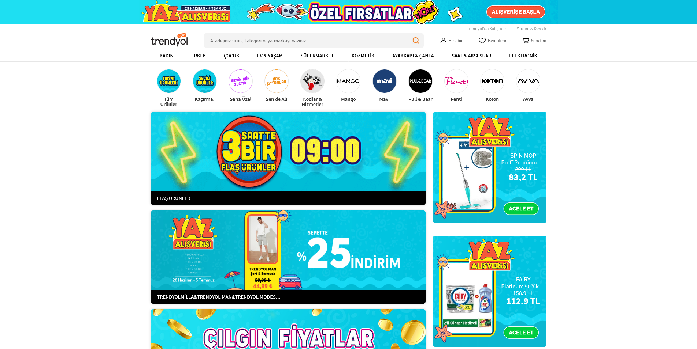
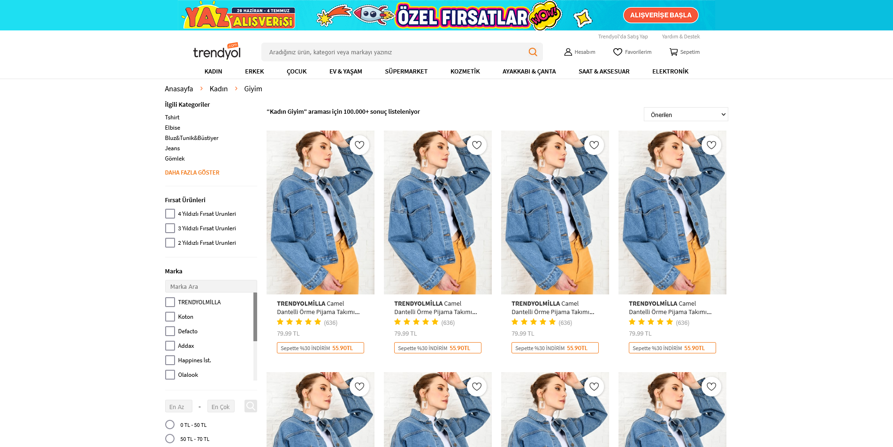

# Week 1 Homework: Trendyol Landing Page with Pair Programming

In the first homework of Trendyol Front-End Bootcamp; Trendyol's homepage and product page were designed using HTML and CSS, along with the design provided on [Figma Design](https://www.figma.com/file/IwnhPC5WBglAFGc0MJ6wXj/Trendyol-Front-End-Bootcamp?node-id=0%3A1). During the project, pair programming was carried out with teams of 3 and 4 people.

**NOTE:** The product page can be accessed via "Giyim", a sub-category of the "Kadın" category.

## Used technologies

- HTML5
- CSS3

## Assistant

- Mehmet Sait Işık

## Team Members

- Pair Team 1 *(Homepage)*
  
  - [Canberk Önem](https://github.com/canberkonem)
  - [Enes Başpınar](https://github.com/baspinarenes)
  - [Oytun Dinç](https://github.com/oytundinc)

- Pair Team 2 *(Product Page)*
  - [Ahmet F. Uzunkaya](https://github.com/MihrimatriX)
  - [Bedirhan Celayir](https://github.com/rokasta12)
  - [Duygu Aktukmak](https://github.com/duyguaktukmak)
  - [Nilgün Canbaz](https://github.com/nilguncanbaz)

## Live Demo

[https://trendyol-demo.netlify.app/](https://trendyol-demo.netlify.app/)

## Screenshots

